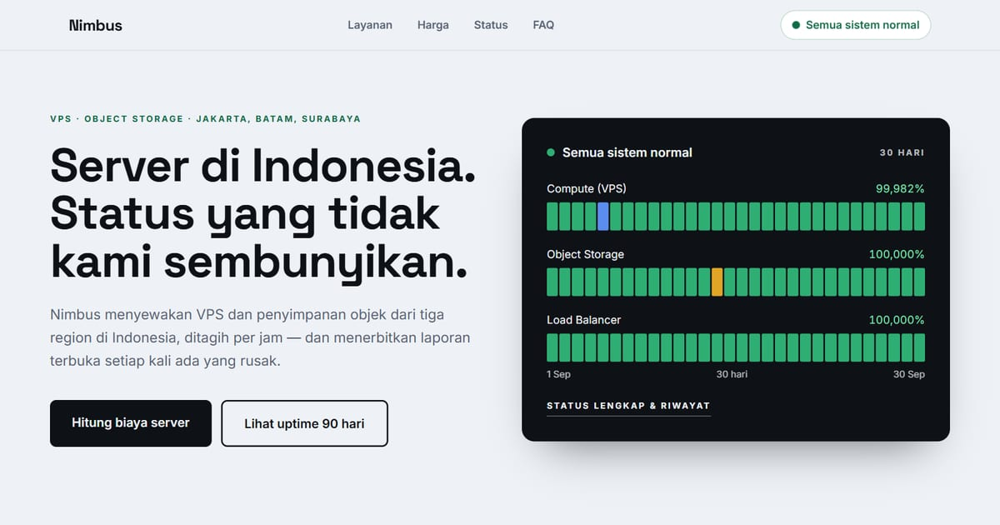

# Nimbus — Server di Indonesia, Status yang Terbuka

Nimbus: VPS dan Object Storage dari Jakarta, Batam, dan Surabaya, ditagih per jam. Uptime 90 hari, laporan insiden terbuka, dan kalkulator harga.

**Demo live:** https://landing-nimbus.vercel.app



> Template landing page untuk bisnis fiktif. Formulir di dalamnya hanya demo dan tidak mengirim data.

## Konsep

Bahasa rupa **Halaman Status**: layanan cloud ditampilkan seperti halaman status uptime yang tenang dan dapat diukur.

## Halaman

- `/` — hero dengan panel status 30 hari, lima komponen, tabel harga VPS, insiden terbaru, FAQ
- `/status` — uptime 90 hari per komponen (dihitung dari data insiden), perawatan terjadwal, riwayat insiden
- `/insiden/[slug]` — laporan insiden: dampak, linimasa per menit, penyebab, tindak lanjut
- `/harga` — kalkulator biaya (paket, jumlah server, storage, transfer), harga satuan, tabel kredit SLA

## Teknologi

- Next.js 15.5 (App Router) dan React 19
- Tailwind CSS v4
- JavaScript
- Bilah uptime dan kalkulator dibuat dengan React + CSS (tanpa pustaka grafik/animasi)
- Font: Space Grotesk, Inter (next/font)
- SEO: metadata per halaman, Open Graph, JSON-LD, sitemap.xml, dan robots.txt

## Menjalankan secara lokal

```bash
npm install
npm run dev
```

Buka http://localhost:3000. Untuk build produksi: `npm run build` lalu `npm start`.

---

Bagian dari koleksi 17 template landing page di [PortalLanding](https://portal-landing-seven.vercel.app). Dibuat oleh [PintuWeb](https://pintuweb.com), jasa pembuatan website.
